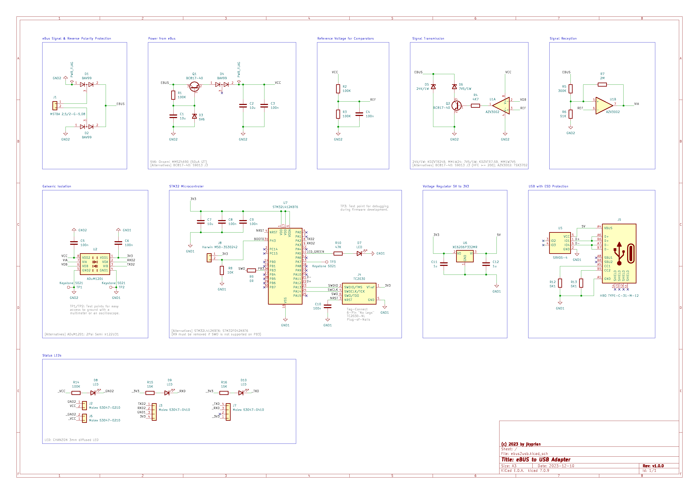

# ebus2usb - 2TE DIN Rail eBUS to USB Type-C Interface

eBUS is a serial 2-wire serial data-bus, often used in heating, solar energy, and other building automation systems. This project provides an interface to access an eBUS via USB.
It uses a series transistor regulator circuit with a low IZT zener diode to extract the operating voltage from the eBUS, an ADuM1201 for the galvanic isolation, and a CH340N for the UART to USB conversion.
Power consumption on the eBUS side is between 620uA (eBUS idle low/8V) and 920uA (eBUS idle high/24V), making the interface qualify as a class 0 device with respect to the eBUS specification.
It has been designed to fit into an [CNMB/1/2](https://www.camdenboss.com/camden-boss/cnmb12-din-rail-module-box%2c-polycarbonate-enclosure%2c-industrial-iot-electronics-housing/c-23/p-18541) 2TE DIN rail enclosure by CAMDENBOSS. The interface is intended to be used with [ebusd](https://github.com/john30/ebusd/) and can be used as a replacement for an [eBUS Adapter v2](https://adapter.ebusd.eu/v2/).

## Schematic

## PCB Layout

When ordering at JLCPCB, remove the mouse bites and cut the boards yourself. Otherwise JLCPCB will charge you for two designs.

## BOM

|Designator|Footprint|Quantity|Value|LCSC Part #
|:---|:---|:---|:---|:---
|C1, C2|C0805|2|10u|C15850
|C3, C4, C5, C6, C7, C8|C0805|6|100n|C28233
|D1, D2|SOT-23-3|2|BAV99|C2500
|D3|SOT-123|1|5V6, Onsemi MMSZ4690*|C152307
|D4|SOD-123|1|24V/1W, KDZVTR24B, MM1W24|C209605, C438336
|D5|SOD-123|1|7V5/1W, KDZVTR7.5B, MM1W7V5|C209594, C382950
|D6, D7, D8|D3.0mm|3||[CHANZON 3mm diffused LED](https://www.aliexpress.com/item/1936229691.html)
|J1|MSTBA_2,5_2-G-5,08|1|MSTBA 2,5/2-G-5,08|C3697
|J2, J5|Molex_PicoBlade_53047-0210|2|Molex 53047-0210|C114130
|J3, J6|Molex_PicoBlade_53047-0410|2|Molex 53047-0410|C504989
|J4|HRO_TYPE-C-31-M-12|1|HRO TYPE-C-31-M-12|C165948
|Q1, Q2|SOT-23-3|2|BC817-40, S9013J3|C52801, C6749
|R1|R0805|1|0R|C17477
|R2, R3, R4, R11|R0805|4|100K|C149504
|R5|R0805|1|4K7|C17673
|R6|R0805|1|270K|C17589
|R7|R0805|1|68K|C17801
|R8|R0805|1|2M|C26112
|R9, R10|R0805|2|5K1|C27834
|R12, R13|R0805|2|22K|C17560
|U1|SO08|1|AZV3002, TSX3702|C5123396, C2970396
|U2|SO08|1|ADuM1201, π122U31|C9669, C471590
|U3|SO08|1|CH340N, CH330N|C2977777
|U4|SOT-23-6L|1|SRV05-4|C85364

\* Low IZT of 50uA is required. Other manufacturers than Onsemi may not qualify. For example, MMSZ4690 from Jiangsu Changjing Elec. Tech. is not recommened.